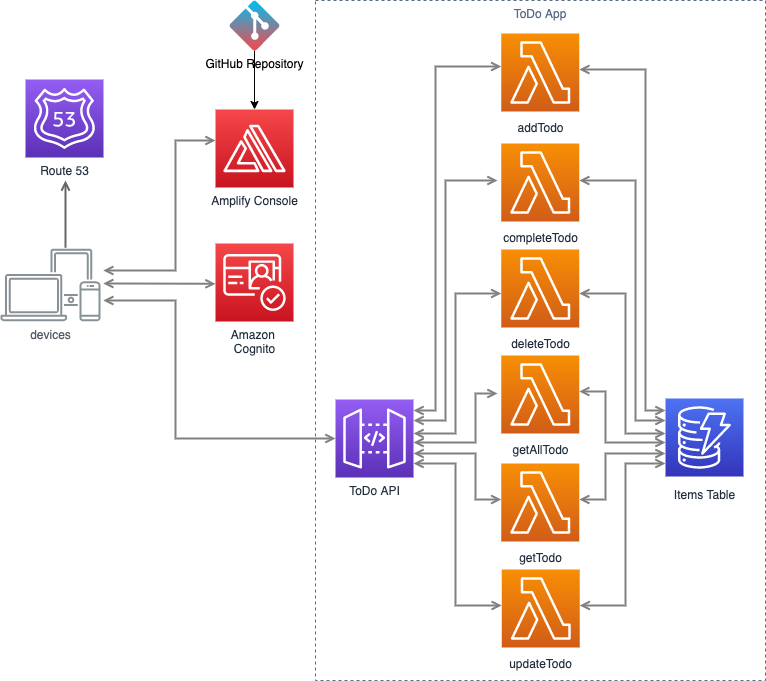

# Arquitetura de Referência Serverless: Aplicação Web

A arquitetura de referência para aplicação web é de proposta geral, orientada a eventos, a camada de API's utiliza [Amazon API Gateway](https://aws.amazon.com/apigateway) e usa [AWS Lambda](https://aws.amazon.com/lambda), para a lógica de negócio. Utiliza também [Amazon DynamoDB](https://aws.amazon.com/dynamodb) como banco de dados e [Amazon Cognito](https://aws.amazon.com/cognito) para gestão de usuários. Todo o conteúdo estático é provido pelo [AWS Amplify Console](https://aws.amazon.com/amplify/console).

Essa aplicação implementa um aplicativo simples de To Do List, no qual um usuário registrado pode criar, atualizar, visualizar e eventualmente apagar os itens existentes.

## Diagrama de Arquitetura



## Componentes da Aplicação

A aplicação web foi constrúida com 3 componentes diferentes.

### Front End 

A aplicação de The front-end é composta apenas por conteúdo estático (HTML, CSS, JavaScript e imagens) que são gerados pelo `create-react-app`. Todos esses objetos são armazenados no AWS Amplify Console.

Quando o usuário conecta ao website, os recursos necessários são carregados para o navegador e executados a partir dele. Quando a aplicação precisa comunicar com o backend, o frontend cria uma requisição REST para o backend.

### Back End (Lógica de Negócio)

O backend da aplicação é onde a lógica de negócio está implementada. O código é implementado usando funções Lambda que são acessadas através do API Gateway - REST API. No nosso caso, temos diferentes funções, cada uma lidando com diferentes aspectos da aplicação: lista de itens a fazer, detalhes sobre um item , atualizar um item, criar um item, marcar um item como completo e apagar um item existente. A aplicação salva todos os itens em uma tabela do DynamoDB.

### Registro de Usuário e Autenticação

Como uma aplicação de To Do contêm informações pessoas, o acesso é restrito a usuário autenticados. Cada usuário pode acessar apenans seus próprios itens.

Para isso está sendo usado o Cognito User Pools, que permite o registro de usuários da aplicação e sua autenticação. Apenas depois de autenticado, o usuário irá receber um token JWT que será usado para realizar as requisições REST API.

---
## Executando o exemplo

Fork esse repositório na sua conta do GitHub, você irá precisar criar um Personal Access Token no Github para a console do Amplify e usar a URL do seu repositório GitHub durante a instalação.

Você pode usar o template [AWS SAM template](../template.yml) para criar a stack que é mostrada nessa arquitetura de referência. Detalhes sobre os recursos criados estão descritos na seção *SAM Template Resources* neste documento.

## Gerando seu token de acesso ao GitHub

Para utilizar a console do Amplify, é necessário gerar o token de acesso pessoal.
Uma vez criato, o token de acesso deve ser guardado de maneira segura, caso seja perdido um novo token precisa ser gerado. 
Para configurar o seu token de acesso, use [New personal access page](https://github.com/settings/tokens/new) no GitHub.

Será necessário sua senha do GitHub para gerar o token de acesso.

### Utilizando SAM e o Amplify Console para criar e instalar os recursos da aplicação

Você pode instalar todos os componentes da aplicação usando o script:

```bash
export AWS_DEFAULT_REGION=<escolha uma regiao, ex: us-east-1>
export STACK_NAME=<nome para a sua Stack de CloudFormation>
./deploy.sh
```

O script irá usar o SAM CLI para compilar as funções do backend, e guiará a instalação. O script irá pedir um conjunto de parâmetros ou aceitar os valores padrões, apenas a URL do repositório no GitHub e o token do GitHub OAuth são obrigatórios.

### Construindo a aplicação - Passo a Passo

Alternativamente, você pode executar os passos para a compilação usando a linha de comando:

#### Compilando as função do backend

O AWS SAM CLI simplifica o processo de compilação para vários ambientes de execução e copia o código fonte para a pasta de *staging* deixando as funções prontas para serem empacotadas e instaladas. O comando `sam build` compila usando qualquer dependência que a aplicação tenha e copia o código fonto para pastas abaixo de aws-sam/build para ser compactados e carregado para o serviço AWS Lambda.

```bash
sam build --use-container
```

#### Empacotando o backend

Execute `sam package` para empacotar a função Lambda e suas dependências em um zip e salvar em um *bucket* no Amazon S3. Será gerado o arquivo packaged.yml com o endereço do *bucket* e a localização do arquivo. Para empacotar a execute o comando abaixo:

```bash
sam package \
    --output-template-file packaged.yml \
    --s3-bucket $DEPLOYMENT_BUCKET
```

#### Instalação do backend

O comando `sam deploy` instala a aplicação no ambiente AWS. Esse comando explicitamente inclui os parâmetros:

* A AWS Region na qual será instalado o pacote da aplicação. Deve ser a mesma região onde está o *bucket* do Amazon S3 que contém o pacote.

* O parâmetro CAPABILITY_IAM, é para permitir que sejam criadas novas IAM roles para as funções Lambda.

```bash
sam deploy \
    --template-file packaged.yml \
    --stack-name $STACK_NAME \
    --capabilities CAPABILITY_IAM
```

#### Teste local (Opcional)

Para executar a função Lambda, API Gateway e o DynamoDB localmente, siga os passos abaixo:

Para executar o DynamoDB localmente

```bash
docker run -p 8000:8000 amazon/dynamodb-local
```

Crie uma tabela DynamoDB em sua instância local

```bash
aws dynamodb create-table --table-name TodoTable --attribute-definitions AttributeName=id,AttributeType=S --key-schema AttributeName=id,KeyType=HASH --billing-mode PAY_PER_REQUEST --endpoint-url http://127.0.0.1:8000
```

Execute o SAM Local Module para testar a aplicação localmente

```bash
sam local start-api --env-vars todo-src/test/environment/mac.json
```

Arquivo de exemplo para MAC OS: `todo-src/test/environment/mac.json`

#### Atualizando o Frontend

Uma vez com a infraestrutura instalada usando o SAM será necessário criar o arquivo de configuração para o frontend da aplicação web. Você pode obter os valores necessários pela descrição do Stack do CloudFormation:

```bash
aws cloudformation describe-stacks --stack-name $STACK_NAME --query "Stacks[0].Outputs[]"
```

Copie o arquivo de configuração padrão e atualize com os valores abaixo:

```bash
cp www/src/config.default.js www/src/config.js
```

Execute o frontend localmente para testes alterando o parâmetro `redirect_url` e `api_base_url` para o endereço `https://localhost:8080` e execute o comando abaixo:

```bash
cd www/src
npm start
```

#### Instalação do Frontend

Deploy your application by checking in your update to the `config.js` file and pushing that commit to your repo. Amplify Console will automatically deploy the update from there.

```bash 
git add www/src/config.js
git commit -m 'Update frontend config'
git push
```

Você pode visualizar o processo de instalação pelo Amplify Console.

## Limpeza dos Recusos

### Apagar a Stack do CloudFormation

```bash
aws cloudformation delete-stack \
--stack-name $STACK_NAME
```

### Apagar o CloudWatch Log Groups

```bash
for log_group in $(aws logs describe-log-groups --log-group-name-prefix '/aws/lambda/'$STACK_NAME --query "logGroups[*].logGroupName" --output text); do
  echo "Removing log group ${log_group}..."
  aws logs delete-log-group --log-group-name ${log_group}
  echo
done
```
---
## SAM Template Resources

### Recursos

O [template](../template.yaml) cria os recursos abaixo:

* **TodoUserPool** - Cognito UserPool que gerencia os usuários da aplicaçào

* **TodoUserPoolTokenClient** - Cognito UserPool Client que é usado pela aplicação web

* **TodoDomain** - Cognito UserPool Domain Name, para identificar o UserPool

* **TodoTable** - Tabela no DynamoDB usada para registrar os itens da lista de ToDo de cada usuário

* **TodoApi** - REST API usada para publicar as funcionalidades da aplicação

* **GetTodoFunction** -  Função Lambda usada para recuperar um item 

* **GetAllTodoFunction** - Função Lambda usada para recuperar todos os itens do usuário

* **CompleteTodoFunction** - Função Lambda usada marcar um item como completo

* **AddTodoFunction** - Função Lambda usada para criar uma novo item

* **UpdateTodoFunction** - Função Lambda usada para atualizar o conteúdo de um item

* **DeleteTodoFunction** - Função Lambda usada para apagar um item

* **ApiGatewayPushToCloudWatchRole** - An IAM role that allows API Gateway to send log events to CloudWatch Logs

* **ApiAccessLogGroup** - loudWatch Logs Log Group usado pelo API Gateway para o log de mensagens

* **AmplifyApp** - Amplify Console application para gerenciar as atualizações do frontend executada pelos gatilhos do GitHub.
* 
* **AmplifyBranch** - Configuração da integração da branch no GitHub com o Amplify

* **AmplifyRole** - IAM role que permite o Amplify executar as ações necessárias para atualização de conteúdo
<br><br>

### Notas

Por padrão, o Node.js HTTP/HTTPS cria uma nova conexão TCP a cada nova requisição. Para evitar o custo de estabelecer uma nova conexão, você pode reutilizar uma conexão existente.

Para operações de curta duração, como consultas ao DynamoDB, a latência para estabelecer a conexão TCP pode ser maior que da operação em si. Adicionalmente, o DynamoDB [encryption at rest](https://docs.aws.amazon.com/amazondynamodb/latest/developerguide/encryption.howitworks.html) é integrado ao [AWS KMS](https://aws.amazon.com/kms), podem ocorrer atrasos porque o banco de dados tem que reestabelecer novas entradas no cache do KMS para cada operação.

A forma mais simples para configurar o SDK para JavaScript para o reuso de conexões TCP é configurar a variável de ambiente `AWS_NODEJS_CONNECTION_REUSE_ENABLED` para 1. Esse recurso foi adicionado na versão [2.463.0](https://github.com/aws/aws-sdk-js/blob/master/CHANGELOG.md#24630) .

Para mais detalhes sobre o reuso de conexões, veja o [Developer Guide](https://docs.aws.amazon.com/sdk-for-javascript/v2/developer-guide/node-reusing-connections.html).

---

## Well-Architected Review

Foi realizada uma revisão do [Well-Architected](https://aws.amazon.com/architecture/well-architected/) para essa aplicação, usando o [Serverless Application Lens](https://d1.awsstatic.com/whitepapers/architecture/AWS-Serverless-Applications-Lens.pdf). Os resultados podem ser encontrados [aqui](../well-architected.md).

## Licenciamento

Essa arquitetura de referência está licenciada sob os termos [Apache 2.0](../LICENSE).
